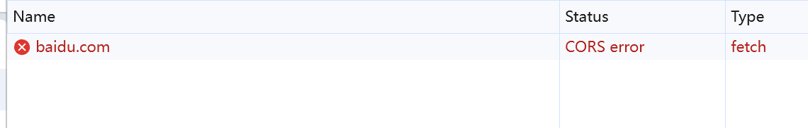
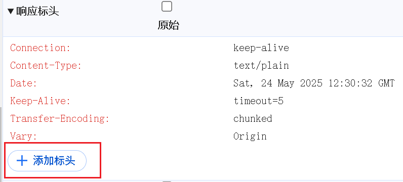
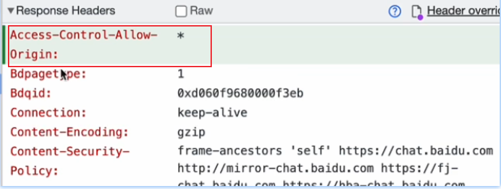
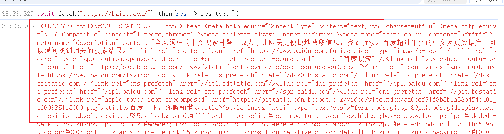

# 网络
## 修改响应头
::: tip 修改响应头，可接收跨域请求
1、在console tab页签下输入fetch("https://baidu.com/"); // 会显示跨域cors

2、在network面板中可以看到一个请求，右键选择`替换标头`，然后在响应标头中可以看到编辑按钮，

3、点击编辑后可添加标头`Access-Control-Allow-Origin: *`

4、添加完标头再重复操作1就能成功请求了。

:::