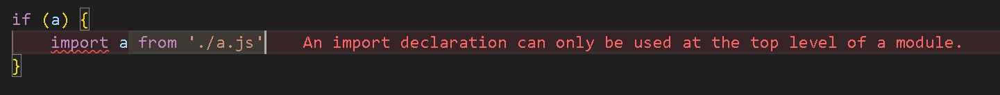
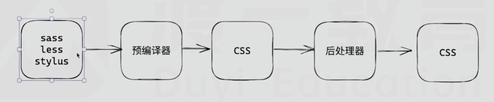
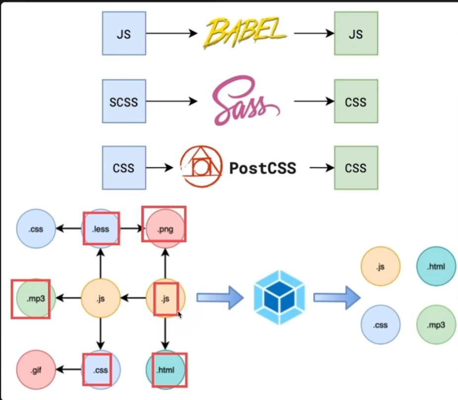
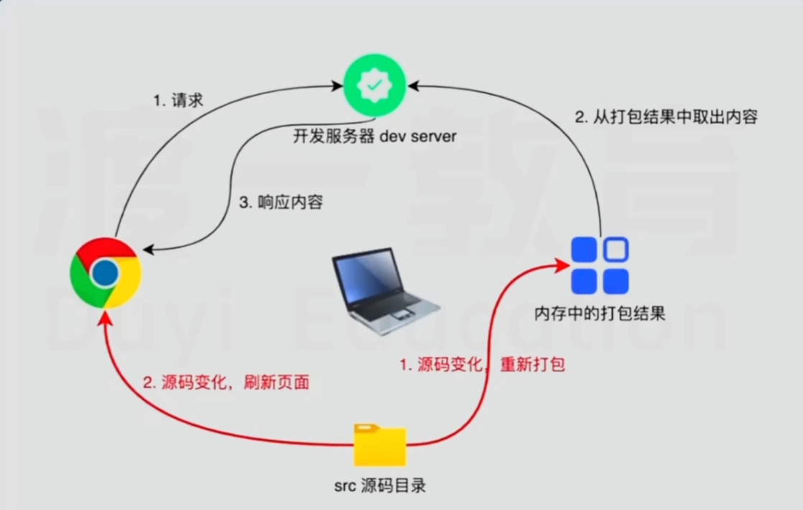

# 前端工程化

---

## 1、前端工程化的意义
## 2、模块化和包管理
::: info 模块化
 - 模块化的本质就是分解和聚合
 - 分解契合的是主观规律，如`函数`、`文件`
 - 聚合契合的是客观规律
文件的问题：
 - 全局污染（分解）
 - 依赖混乱（聚合）
 - 模块化解决文件级别的分解/聚合问题

**模块化的标准**
- 1.`CommonJS CJS`(运行时)
- 2.AMD
- 3.CMD
- 4.UMD
- 5.`Ecmascript Module  ESM`（编译时）


- 绝大部分的打包工具都是ESM，便于进行优化

**模块化的实现**
- 浏览器支支持`ESM`
- nodejs两种都支持`CJS/ESM`
- 构建工具一般两种都支持`CJS/ESM`，像webpack，都推荐采用`ESM`
:::

::: warning 运行时和编译时

- __运行时__：只有代码运行到这里才能知道引入的文件是哪个js【模块化代表：`CommonJS`】
```js
if (a) {
    require("./a.js");
} else if (b) {
    require("./b.js");
}
```
- **编译时**：运行之前就能确定依赖关系【模块化代表：`Ecmascript Module`】
-  <font style="color: green">import语句都要写在代码顶部，不能放到 if else里面</font>




:::

::: info 包管理
- npm
- pnpm
- yarn
:::

## 3、JS工具链

- 语法兼容性(runtime)
- API兼容性：polyfill，主要是用core-js
- 语言增强： tsc
::: info 代码转换：代码集成转换工具，babel
- 预设（本质就是一堆插件）
- 基础预设：@babel/preset-env
:::
## 4、CSS工具链
### 语言缺失
- 语法缺失（循环/判断/拼接）
- 功能缺失（颜色函数，数学函数，自定义函数）
::: info css预编译语言
- stylus
- sass
- less
:::

::: info postcss
- 后编译语言
- [postcss](https://postcss.org/docs/)

:::

::: tip 流程

:::
## 5、构建工具和脚手架
::: info 文件指纹
- 没有文件指纹就会访问缓存，不会更新
:::

::: info 构建工具
- 构建工具就是把babel/sass/postcss所做的事情统一处理了


:::

### 开发服务器devServer


::: tip 脚手架
- vue-cli
- vite
- cra
:::


