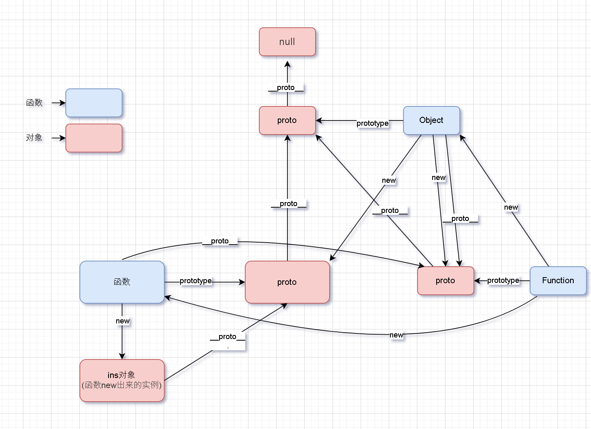
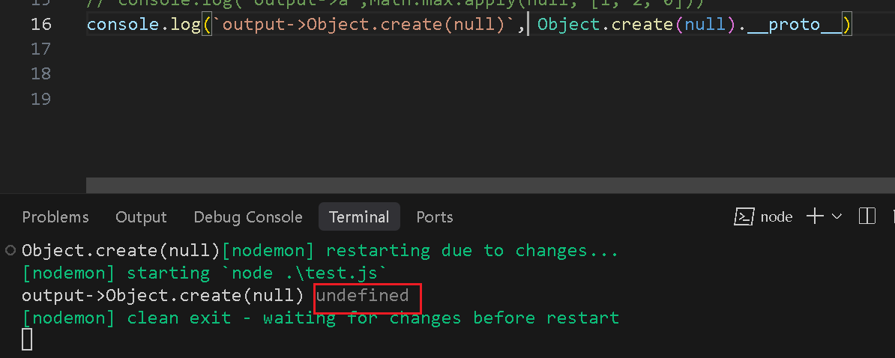

# JavaScript原型链

## 1、原型链的概念

::: info 什么是原型链
- 原型链是JavaScript实现继承的主要方式
- 每个函数对象都有一个原型对象（prototype）
- 对象会从原型对象继承属性和方法
- 原型对象也可能有自己的原型，形成原型链
- 所有对象都是new函数而得到的
- 原型链的基本结构就是函数==>实例==>原型对象三者之间的闭环
:::

::: tip 原型链的基本概念
- `__proto__`：对象的隐式原型，指向构造函数的prototype
- `prototype`：构造函数的显式原型
- `constructor`：指向构造函数本身
:::

## 2、原型链的实现

### 2.1 构造函数创建对象
```javascript
function Person(name) {
    this.name = name;
}

Person.prototype.sayHello = function() {
    console.log(`Hello, I'm ${this.name}`);
}

const person = new Person('张三');
person.sayHello(); // 输出：Hello, I'm 张三
```

### 2.2 原型链的继承
```javascript
function Student(name, grade) {
    Person.call(this, name);
    this.grade = grade;
}

// 设置原型链
Student.prototype = Object.create(Person.prototype);
Student.prototype.constructor = Student;

const student = new Student('李四', '三年级');
student.sayHello(); // 输出：Hello, I'm 李四
```

## 3、原型链的使用场景

::: info 常见使用场景
1. 实现继承
   - 代码复用
   - 扩展功能
   - 多态实现

2. 共享属性和方法
   - 减少内存占用
   - 提高性能

3. 原型链上的方法可以被所有实例共享
:::

## 4、流程图
::: info 原型链流程图

:::

## 5、注意事项

::: warning 原型链的注意事项
1. 原型链过长会影响性能
   - 属性查找会逐级向上
   - 建议控制原型链层级

2. 原型链上的属性是共享的
   - 引用类型属性要特别注意
   - 实例属性会覆盖原型属性

3. 构造函数中的this指向
   - 构造函数中的this指向实例
   - 原型方法中的this指向调用者
:::

## 6、最佳实践

::: tip 原型链的最佳实践
1. 优先使用组合继承
   - 结合构造函数和原型链的优点
   - 避免原型链的缺点

2. 使用Object.create()创建对象
   - 更清晰的继承关系
   - 更好的性能

3. 合理使用原型方法
   - 共享方法放在原型上
   - 实例特有的属性放在构造函数中
:::

## 7、常见问题

::: info 原型链相关常见问题
1. 原型链的终点是什么？
   - Object.prototype
   - 再往上就是null

2. 如何判断属性是否在原型链上？
   - hasOwnProperty()
   - Object.getOwnPropertyNames()

3. 如何安全地扩展原型？
   - 使用Object.defineProperty()
   - 避免直接修改内置对象的原型

4. a instanceof b 怎么理解？
   - b.prototype是否存在于a的原型链上

5. 所有js对象都有__proto__吗？
   - 不是的，由Object.create(null)创建的对象没有__proto__
   
:::
