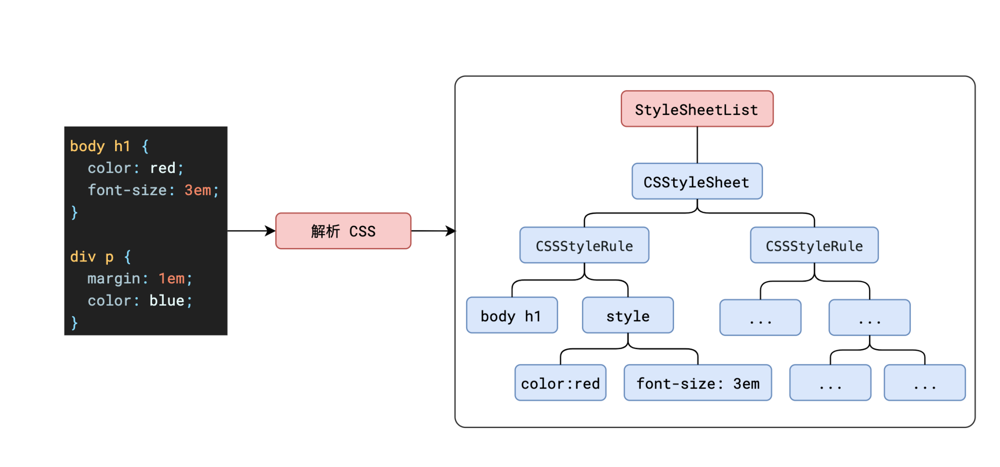
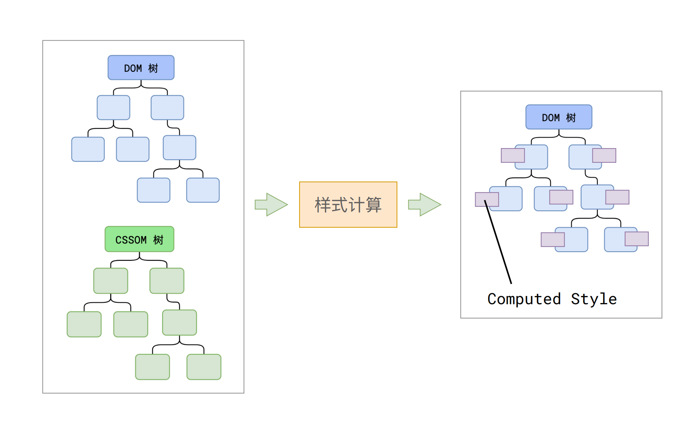

# 浏览器是如何渲染页面的？

<!-- *渡一公开课学习笔记* -->

当浏览器的`网络线程`收到 HTML 文档后，会产生一个渲染任务，并将其传递给`渲染主线程`的消息队列。

在事件循环机制的作用下，渲染主线程取出消息队列中的`渲染任务`，开启渲染流程。

-------

整个渲染流程分为多个阶段，分别是：
- HTML 解析
- 样式计算
- 布局
- 分层
- 绘制
- 分块
- 光栅化
- 画

每个阶段都有明确的输入输出，上一个阶段的输出会成为下一个阶段的输入。

这样，整个渲染流程就形成了一套组织严密的生产流水线。

## 解析HTML（Parse HTML）
解析过程中遇到 CSS 解析 CSS，遇到 JS 执行 JS。为了提高解析效率，浏览器在开始解析前，会启动一个`预解析的线程`，率先下载 HTML 中的外部 CSS 文件和 外部的 JS 文件。

::: info 解析dom树

:::

::: info 解析cssom树
- 浏览器的默认样式
- 内部样式
- 外部样式
- 行内样式

均会包含在 CSSOM 树中。

:::

如果主线程解析到`link`位置，此时外部的 CSS 文件还没有下载解析好，`主线程不会等待`，继续解析后续的 HTML。这是因为下载和解析 CSS 的工作是在 预解析线程中进行 的。这就是 CSS 不会阻塞 HTML 解析的根本原因。

如果主线程解析到`script`位置，会停止解析 HTML，转而等待 JS 文件下载好，并将全局代码解析执行完成后，才能继续解析 HTML。这是因为 `JS 代码的执行过程可能会修改当前的 DOM 树`，所以 DOM 树的生成必须暂停。这就是 JS 会阻塞 HTML 解析的根本原因。

第一步完成后，会得到 DOM 树和 CSSOM 树

## 样式计算(Recalculate Style)

主线程会遍历得到的 DOM 树，依次为树中的每个节点计算出它最终的样式，称之为 Computed Style。

在这一过程中，很多预设值会变成绝对值，比如`red`会变成`rgb(255,0,0)`；相对单位会变成绝对单位，比如`em`会变成`px`

这一步完成后，会得到一棵带有样式的 DOM 树。
::: info css属性计算
- 确定声明值
- 层叠冲突
  - 比较源的重要性【对应的重要性顺序依次为：页面作者样式 > 用户样式 > 用户代理样式】
  - 比较优先级[*https://developer.mozilla.org/en-US/docs/Web/CSS/Specificity*]
  - 比较次序 *【上面解决了相同元素被声明了多条样式规则究竟应用哪一条样式规则的问题】*
- 使用继承
- 使用默认值
:::

## 布局(Layout)

布局阶段会依次遍历 DOM 树的每一个节点，计算每个节点的`几何信息`。例如节点的`宽高`、相对`包含块`的位置。

大部分时候，DOM 树和布局树并非一一对应。

比如`display:none`的节点没有几何信息，因此不会生成到布局树；又比如使用了伪元素选择器，虽然 DOM 树中不存在这些伪元素节点，但它们拥有几何信息，所以会生成到布局树中。还有`匿名行盒`、`匿名块盒`等等都会导致 DOM 树和布局树无法一一对应。

::: info 匿名行盒/匿名块盒
- 1.内容必须在行盒中：所有文本内容都必须放在行盒中，否则浏览器会生成匿名行盒
- 2.行盒和块盒不能相邻：行盒和块盒的布局方式不同，直接相邻可能导致内容错位或重叠
  

:::

## 分层(Layer)

主线程会使用一套复杂的策略对整个布局树中进行分层。

分层的主要作用是提高渲染效率。当某个元素需要频繁更新（如动画、滚动条等），分层可以避免整个页面重新渲染，从而减少重排和重绘的开销。例如，`video`和`canvas`元素通常会被自动分层，因为它们的内容需要频繁更新

滚动条、堆叠上下文、transform、opacity 等样式都会或多或少的影响分层结果，也可以通过`will-change`属性更大程度的影响分层结果。

::: info 影响分层的因素
- `z-index`属性值不为`auto`的层叠上下文
- `position`属性值不为`static`的层叠上下文
- `opacity`属性值不为`1`的层叠上下文
- `transform`属性值不为`none`的层叠上下文
- `filter`属性值不为`none`的层叠上下文
- `will-change`属性值为`transform`/`opacity`/`filter`的层叠上下文
- `contain`属性值为`layout`/`style`的层叠上下文
:::

## 绘制(Paint)

主线程会为每个层单独产生绘制指令集，用于描述这一层的内容该如何画出来。

完成绘制后，主线程将每个图层的绘制信息提交给合成线程，剩余工作将由合成线程完成。

## 分块(Tiling)

合成线程首先对每个图层进行分块，将其划分为更多的小区域。

它会从线程池中拿取多个线程来完成分块工作。

## 光栅化(Raster)

合成线程会将块信息交给 GPU 进程，以极高的速度完成光栅化。

- 将块转换为位图
- 将位图上传到GPU
- 优先处理靠近视口的块

GPU 进程会开启多个线程来完成光栅化，并且优先处理靠近视口区域的块。

光栅化的结果，就是一块一块的位图

## 画(Draw)

合成线程拿到每个层、每个块的位图后，生成一个个「指引（quad）」信息。

指引会标识出每个位图应该画到屏幕的哪个位置，以及会考虑到旋转、缩放等变形。

合成线程会把 quad 提交给 GPU 进程，由 GPU 进程产生系统调用，提交给 GPU 硬件，完成最终的屏幕成像。

::: tip 完整流程

:::

::: info 渲染主进程 【沙盒里执行】
- 渲染线程
- 合成线程
:::

## 常见问题

### 什么是 reflow？

reflow 的本质就是重新计算 layout 树。

当进行了会影响布局树的操作后，需要重新计算布局树，会引发 layout。

为了避免连续的多次操作导致布局树反复计算，浏览器会合并这些操作，当 JS 代码全部完成后再进行统一计算。所以，改动属性造成的 reflow 是异步完成的。

也同样因为如此，当 JS 获取布局属性时，就可能造成无法获取到最新的布局信息。

浏览器在反复权衡下，最终决定获取属性立即 reflow。

### 什么是 repaint？

repaint 的本质就是重新根据分层信息计算了绘制指令。

当改动了`可见样式`后，就需要重新计算，会引发 repaint。

由于元素的布局信息也属于可见样式，所以 reflow 一定会引起 repaint。

### 为什么 transform 的效率高？

当你使用 transform 属性改变元素的位置、大小或旋转时，它不会影响文档流，也不会导致页面的重新布局（重排），它影响的只是渲染流程的最后一个「draw」阶段

由于 draw 阶段在合成线程中，所以 transform 的变化几乎不会影响渲染主线程。反之，渲染主线程无论如何忙碌，也不会影响 transform 的变化。

