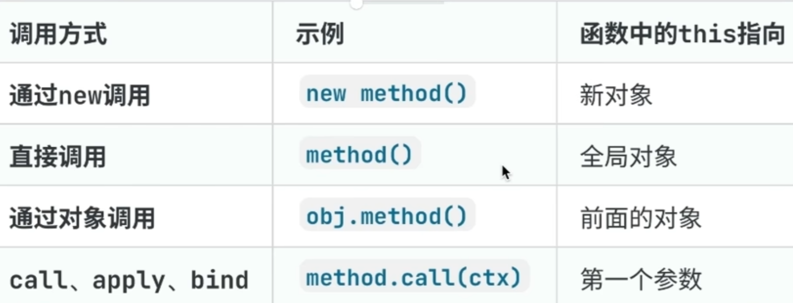

# JavaScript中的this指向

## 1、this的基本概念

::: info this的本质
- this是JavaScript中的一个关键字
- this指向当前代码执行的上下文对象
- this的指向在函数执行时才能确定
- this的指向取决于函数的调用方式
:::

::: tip 调用方式有如下四种：

:::

## 2、浏览器和Node环境的区别

### 2.1 全局环境下的this
```javascript
// 浏览器环境
console.log(this); // Window对象

// Node环境
console.log(this); // {}
```

### 2.2 函数中的this
```javascript
// 浏览器环境
function test() {
    console.log(this); // Window对象
}
test();

// Node环境
function test() {
    console.log(this); // global对象
}
test();
```

### 2.3 严格模式下的区别
```javascript
'use strict';

// 浏览器环境
function test() {
    console.log(this); // undefined
}
test();

// Node环境
function test() {
    console.log(this); // undefined
}
test();
```

## 3、this的指向规则

### 3.1 默认绑定
```javascript
// 浏览器环境
function test() {
    console.log(this); // Window对象
}
test();

// Node环境
function test() {
    console.log(this); // global对象
}
test();
```

### 3.2 隐式绑定
```javascript
// 浏览器和Node环境行为一致
const obj = {
    name: '张三',
    sayName() {
        console.log(this.name);
    }
};
obj.sayName(); // '张三'
```

### 3.3 显式绑定
```javascript
// 浏览器和Node环境行为一致
function sayName() {
    console.log(this.name);
}

const person = { name: '李四' };

// 使用call
sayName.call(person); // '李四'

// 使用apply
sayName.apply(person); // '李四'

// 使用bind
const boundSayName = sayName.bind(person);
boundSayName(); // '李四'
```

### 3.4 new绑定
```javascript
// 浏览器和Node环境行为一致
function Person(name) {
    this.name = name;
}

const person = new Person('王五');
console.log(person.name); // '王五'
```

## 4、特殊情况

::: warning this指向的特殊情况
1. 箭头函数
   - 箭头函数没有自己的this
   - this指向外层作用域的this
   ```javascript
   // 浏览器环境
   const obj = {
       name: '张三',
       sayName: () => {
           console.log(this.name); // undefined
       }
   };

   // Node环境
   const obj = {
       name: '张三',
       sayName: () => {
           console.log(this.name); // undefined
       }
   };
   ```

2. 回调函数
   - 回调函数中的this可能发生改变
   ```javascript
   // 浏览器环境
   const obj = {
       name: '张三',
       sayName() {
           setTimeout(function() {
               console.log(this.name); // undefined
           }, 100);
       }
   };

   // Node环境
   const obj = {
       name: '张三',
       sayName() {
           setTimeout(function() {
               console.log(this.name); // undefined
           }, 100);
       }
   };
   ```

3. 模块中的this
   ```javascript
   // Node环境
   console.log(this); // module.exports
   console.log(this === module.exports); // true
   ```
:::

## 5、最佳实践

::: info this使用的最佳实践
1. 优先使用箭头函数
   - 避免this指向混乱
   - 代码更简洁清晰

2. 合理使用显式绑定
   - 明确指定this的指向
   - 提高代码可维护性

3. 注意环境差异
   - 浏览器环境：全局this指向Window
   - Node环境：全局this指向空对象
   - 模块中this指向module.exports

4. 避免过度使用this
   - 过度使用this会增加代码复杂度
   - 可能导致代码难以维护
:::

## 6、常见面试题

::: tip this相关面试题
1. 浏览器和Node环境中this的区别？
   - 全局环境：浏览器指向Window，Node指向空对象
   - 函数环境：浏览器指向Window，Node指向global
   - 模块环境：Node中指向module.exports

2. 如何改变函数中this的指向？
   - 使用call/apply/bind
   - 使用箭头函数
   - 使用new关键字

3. 箭头函数和普通函数的区别？
   - 箭头函数没有自己的this
   - 箭头函数不能作为构造函数
   - 箭头函数没有arguments对象
:::

